# RETO: BANCO DIGITAL PARA MILLENNIALS "BANKLY"

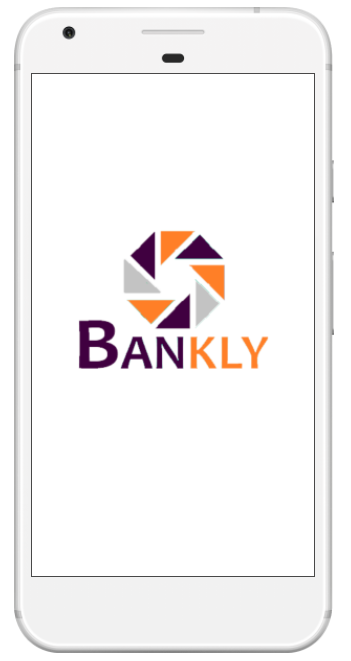

* **TRACK:** _ESPECIALIZACIÓN UX-DESIGNER_
* **CURSO:** _CONOCCIENDO LOS NEGOCIOS_
* **UNIDAD 1:** _LECCIONES BÁSICAS DE NEGOCIOS_
* **UNIDAD 2:** _LECCIONES SOBRE DISEÑO Y TECNOLOGÍA_

***

## Equipo de trabajo

+ Colqui Santos, L. Vanessa.
+ Humpire, Esthefany.

***

## Descripción del reto

* Reto 1:

  El Banco del País es uno de los bancos más importante de tu país. Es una institución de muchos años y actualmente está pasando por un proceso de transformación digital. Como parte de este proceso, han implementado un área de innovación que quiere llegar de una mejor manera a los usuarios más jóvenes. Por lo que, inspirados en Nequi, Nubank y Simple se han propuesto crear un banco 100% digital dirigido para millenials. Es tu primera semana en la empresa y te han pedido que te encargues de esa investigación. Tu reto ahora es:

  - Identificar quiénes son los stakeholders de tu proyecto.
  - Planear una reunión de kick - off detallando.
  - Quiénes deberían estar presentes.
  - Qué les preguntarías a los presentes.
  El product manager encargado te ha pedido además que para la sesión de kick - off, vengas con un Business Model Canvas (hipotético) del producto "Banco 100% digital", para que así los stakeholders puedan validar o invalidar las hipótesis o pedirte que te enfoques en validar alguna hipótesis durante la investigación.
  Además, te piden que llegues a la reunión de kick - off con un plan propuesto de investigación, en el que detalles qué actividades de investigación, según tu criterio se deberían realizar, sustentando el por qué propones c/u de esas actividades.

* Reto 2:

  - Llevar a cabo las actividades de investigación.
  - Crear un prototipo de la nueva banca digital - basado en el journey más crítico que encuentres en tu investigación.
  - Hacer sesiones de testing.
  - Iterar y concluir

***

## Objetivo

  Definir un MVP (prototipo) de los bancos digitales para millennials.

***

## Desarrollo

 - Para definir el negocio se identificaron a los Stakeholders, Plan de Kick-Off, BCM y Plan de Research.
 - Para la resolución del reto seguimos las estapas de DCU (Diseño Centrado en el Usuario).
 - Para la organización y planificación usamos la herramienta Trello,  [Banco digital para Millennials](https://trello.com/b/SRu4SJju/reto-ux-nuevo-banco-digital).

## Etapas de desarrollo del negocio

## A. Identificar a los Stakeholders

   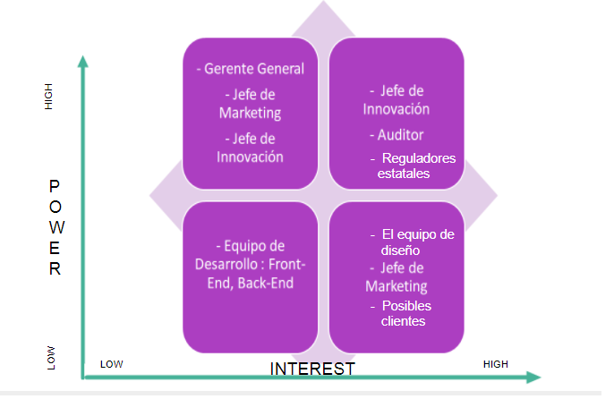

## B. Plantear el Kick-Off Meeting

   ### Antes de la reunión
   * Conocer todo sobre el proyecto
    - ¿Cuál es el objetivo del proyecto?
    - ¿Qué beneficios, cual es el valor que aportará a la organización? (tanto a tu organización como al cliente)
    - ¿Cuál es el alcance del proyecto y sus entregables principales?
    - ¿Cuáles son las fechas críticas (hitos) del proyecto?
    - ¿Cuál es su coste?
    - ¿Cuáles son los principales riesgos asociados al proyecto?
   * Conocer el entorno del proyecto
    - ¿Existe algún supuesto, premisa, restricción o exclusión que se tiene que tener en cuenta?
   * Entender el entorno (la organización, el sector,…) en el que se va a desarrollar el proyecto
   * Conocer a los principales stakeholders
   * Identificar y conocer los stakeholders (interesados/afectados) del proyecto.
   * Establecer una agenda, que responda lo siguiente:
    - ¿Por qué? Por qué se está haciendo el proyecto. Qué busca resolver.
    - ¿Qué? En qué consiste la solución. Qué se va hacer. 
    - ¿Cómo? Cómo se va a trabajar.
    - ¿Cuándo? Cuándo se tendrán que hacer las cosas.
    - ¿Quién? Quién va hacer qué.

### Durante la reunión
   - El objetivo es conocer de primera mano las expectativas, las principales preocupaciones y, sobre todo, reducir o al menos minimizar las incertidumbres que pueda haber, de los asistentes.
   - Mostrar el objetivo y misión del proyecto y su alcance.
   - Presentar el calendario global (no tiene que ser detallado) con los principales hitos y entregables que se van a producir.
   - Mostrar los riesgos que se identificó y abrir un breve debate sobre si alguno de los presentes tiene identificado algún riesgo más.
   - ¿Qué opina el equipo que va a desarrollar el proyecto sobre la audiencia al cual va dirigido?
   - ¿Cuáles son los lugares o las situaciones en los que el equipo cree que puede funcionar el resultado del proyecto?
   - ¿Qué expectativas se podrían tener de la respuesta de los posibles clientes/usuarios del resultado del proyecto?
   - Presentar al equipo del proyecto, cuáles son sus roles y sus responsabilidades. En aquellos roles que no esté claro quién será la persona asignada (sobre todo en roles del cliente), es el momento adecuado para definirlos y establecer los canales de comunicación y niveles de escalación para posibles incidencias que puedan surgir.

### Después de la reunión
   - Elaborar el acta y distribuirla a todos los asistentes (como máximo, dentro de los dos días siguientes a la celebración de la reunión).
   - Mandar un comunicado a los involucrados clave que no participaron en el kick-off  del arranque oficial del proyecto.

## C. Plantear el Modelo de Negocios Canvas

   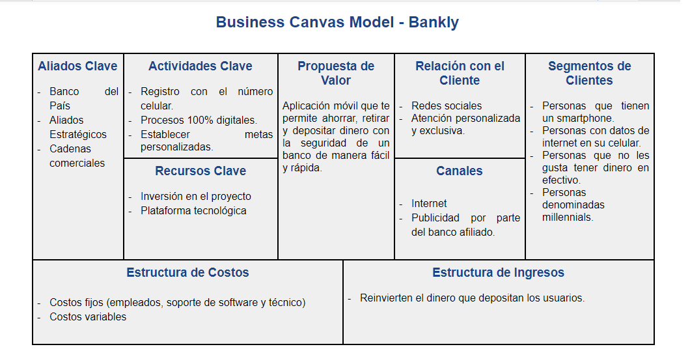

## D. Definir el Plan Propuesto de Investigación

   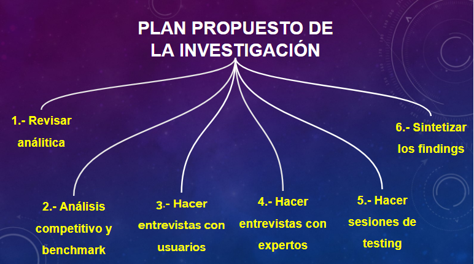
   
   ### Actividades:
   * 1.- Revisar análitica
     + Buscar datos cuantitativos.
       - Identificar porcentaje y edad de los millennials que tienen una cuenta bancaria.
       - Indicadores socioeconómicos de los millennials.
       - Encuestas para conocer las necesidades y/o problemas financieros de los millennials.
       - Analizar la data de las encuestas.
     + Buscar datos cualitativos.
       - Identificar las transacciones digitales que se pueden realizar.
       - Identificar los procesos  que realizan los bancos.
       - Identificar los procesos digitales que realizan los bancos.
       - Identificar las limitaciones tecnológicas o técnicas que tienen los bancos o financieras para sus procesos digitales.
       - Entrevistas a clientes finales (millennials)
       - Entrevistas a clientes o potenciales socios (financieras)

    * 2.- Análisis competitivo y benchmark
      - Conocer los bancos o financieras nacionales que realizan transacciones digitales.
      - Conocer los bancos o financieras extranjeras que realizan transacciones digitales.
      - Realizar el benchmark de las entidades identificadas.
      - Realizar un análisis comparativo entre las entidades ya propuestas.

    * 3.- Hacer entrevistas con usuarios
      - Identificar y definir las preguntas a realizar a los usuarios, a través de brainstorming.
      - Realizar un modelo de entrevista.
      - Identificar y definir los lugares a dirigirnos para realizar las entrevistas. 

    * 4.- Hacer entrevistas con expertos
      - Identificar y definir las preguntas a realizar a los expertos, a través de brainstorming.
      - Definir nuestros stakeholders.
      - Plantear las preguntas clave a realizarse a los stake holders.

    * 5.- Hacer sesiones de testing de la aplicación actual
      - Definir un prototipo hipotético.
      - Realizar el testeo del prototipo hipotético a más de 5 personas.
      - Identificar y sintetizar los feedback recibidos del prototipo hipotético.
      - Definir los puntos a mejorar del prototipo hipotético. 

    * 6.- Sintetizar los findings
      - Definir las funcionalidades clave.
      - Definir nuestro business model canvas.

## Etapas DCU (Diseño Centrado en el Usuario)

## A. Descubrimiento e Investigación

   ### Actividades:

   #### 1.- Formulación de las preguntas para la entrevista con usuarios y la encuesta online

   - A través de la herramienta: lluvia de ideas, logramos definir las preguntas para la entrevista; teniendo en consideración el objetivo identificado.
   [Preguntas para la entrevista con usuarios:]().
   [Preguntas para la encuesta online con usuarios:]().

   #### 2.- Entrevista con usuarios y expertos

   - Recolección de datos presencial.
   - Universidad César Vallejo, 5 usuarios de edades entre 20 y 25 años de edad (millennials) .

   #### 3.- Encuesta online a través de Google Drive

   - Recolección de datos online, a través de publicaciones en el facebook, correo electrónico, etc. Se obtuvo  respuestas.

   .
   .
   .

   #### 4.- Investigación por internet ( web de empresas de buses, agencia de venta de pasajes, encuestas o estudios anteriores, foros, facebook, apps, etc)

   - Se identificaron los temas a investigar en internet: plataformas online, todo sobre las empresas de buses, etc.
   [Millennials_tarjetas de crédito](https://gestion.pe/tu-dinero/millennials-descartan-tarjetas-credito-amenazan-sector-ee-uu-228222).
   [Definición de millennials](https://es.wikipedia.org/wiki/Generaci%C3%B3n_Y).
   [Transformación digital](https://gestion.pe/blog/innovar-o-ser-cambiado/2017/07/transformacion-digital-en-la-banca-peruana.html).

 ## B. Síntesis y Definición

   ### Actividades:

   #### 1.- Definición del problema: Diagrama de afinidad.

   Se utilizó el diagrama de afinidad, a través los siguientes pasos:
   - Paso 1.- En posits se colocó los comentarios( cosas que no les gusta, cosas que desearían, quejas, cosas que no quedaron claras, etc) tal cual como los usuarios lo mencionaron sin interpretaciones ni deducciones; dichos usuarios fueron de las entrevistas y encuestas.

   - Paso 2.-  Se agrupó  los posits por temas. El fin de esta actividad fue organizar lo recolectado para tener cosas claras y especificas  agrupadas en temas. Los temas que surgieron fueron: Dispositivos, tipos de cuenta, tipos de transacciones, elección del banco, reclamos y sugerencias.

   .png).
   .png).

   #### 2.- Definición de los User personas.

   #### 6.- Definición de los Problems Statements.

   - Se definió los problems statements en base a las necesidades de nuestros user persons ). Se usó el modelo:

        -  " CARLA NECESITA {necesidad} PORQUE/PARA {insight}".

   - Esta actividad nos ayuda más a centrarnos en los resultados que en el producto, ya que esta lista  de las necesidades de Carla y el motivo de sus necesidades, nos permite ir viendo formas de resolver ( HMW) específicamente cada necesidad punto por punto.

   - Lista de los Problems stataments identificados:

       - **Carla necesita** atención rápida en ventanilla,**para** sus pagos.
       - **Carla necesita** pagar de manera segura sus deudas en su móvil **porque** desea confiar en un Banco.
       - **Carla necesita** que el Banco le resuelva sus problemas a través de su móvil, **para** sentirse sastisfecha con un Banco.
       - **Carla necesita** orientación personalizada de sus estados financieros, **para** no sentirse engañada.
       - **Carla necesita** que el Banco no le cobre comisiones **para** sentirse parte importante del Banco.
       - **Carla necesita** hacer todas sus transacciones desde su celular  **porque** valora el tiempo libre fuera del Banco, haciendo lo que le gusta.
       - **Carla necesita** orientación sobre los servicios que ofrece el Banco **para** hacer uso de las mismas de manera satisfecha.

   #### 7.- Definición de lo HMW( How Might We?).

  - Se definió los HMW donde  se planteó preguntas tomando como base los PROBLEMS STATEMENTS  ya elaborados en la actividad anterior. se siguió  siguiendo el modelo **¿Cómo podríamos hacer X cosa?**.

       - ¿Cómo podríamos brindar una atención rápida de los servicios que ofrece el Banco a Carla?
       - ¿Cómo podríamos brindar seguridad a Carla cuando pagan sus deudas a través de móvil?
       - ¿Cómo podríamos mejorar la atención frente a reclamos o problemas del cliente?
       - ¿Cómo podríamos orientar de forma personalizada sobre los servicios que obrece el Banco y de los estados financieros del cliente?
       - ¿Cómo podríamos ofrecerle al cliente mejorar la atención a Carla?
       - ¿Cómo podríamos brindar a Carla todas las operaciones full móvil?

   #### 8.- Definición de los WHAT IF?

   - En base a los HMW (Cómo podríamos hacer "x" cosa) definimos los WHAT IF? (¿que tal si?) que nos permitieron encontrar algunas soluciones a situaciones especificas.

       - **What if** ¿Todas las operaciones se realizaran a través del celular?
       - **What if** ¿Se desarrolla un sistema de seguridad a través de preguntas antes de hacer una operación en el celular?
       - **What if** ¿Se muestran los ingresos y egresos diarios de los clientes a través de su celular?
       - **What if** ¿Los clientes podrían definir metas mensuales con ahorro automático?
       - **What if** ¿Los clientes puedan pagar sus servicios rápidamente a través de su celular?
       - **What if** ¿Los clientes puedan personalizar los pagos a realizar mensualmente?

   #### 9.- Definición de FEATURE LIST.

 ## C. Ideación

   ### Actividades:

   #### 2.- Realización de un Story board.

   Partiendo de nuestro user persona, creamos un storyboard, con los momentos que tiene el usuario a lo largo de su proceso de realizar transacciones.

   Así como también a tener más claro hacia dónde queremos llevar el diseño de nuestro producto y poder resolver de la manera más óptima la necesidad de nuestro usuario a cubrir.

 ## D. Prototipado

  ### Actividades:

  #### 1.- Realización del Prototype Content(02/02/2018 y 05/02/2018).

  - Se realizó el prototype content de nuestro MVP.

 
  #### 2.- Realización del Paper Prototyping

  - Sé hizo un prototipo inicial en papel de nuestro MVP.

  - Nos basamos en el flujo que se hizo en el prototype content y story board. 

   

  - El hacer el prototipo inicial en papel nos permitió tener una interfaz de baja fidelidad, económico que nos ayudó a verificar si los usuarios son capaces de realizar sus tareas (identificar claramente los componentes que le llevara a entender una funcionalidad; y una navegación clara) con la interfaz propuesta, ver las dificultades que tiene, que cosas no le gusta; y de esta manera,sin más costo, cambiar dichos requerimientos, observaciones o recomendaciones y volver a testearla hasta tener una interfaz entendible y satisfactorio para el usuario antes de mandarlo al diseño de un interfaz de alta fidelidad.

  #### 4.- Realización del Prototipado - Alta fidelidad (Versión 01)
    
   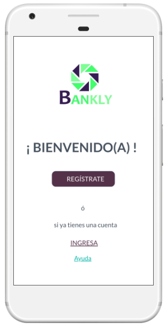
   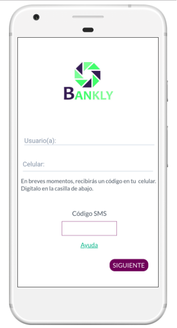
   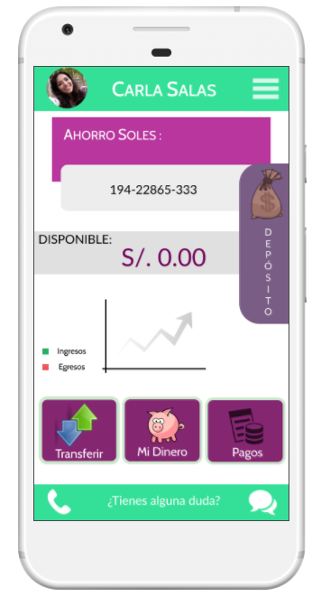
   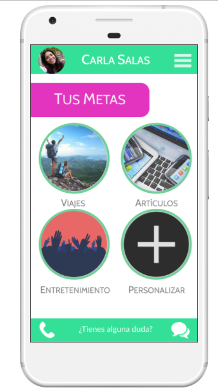
   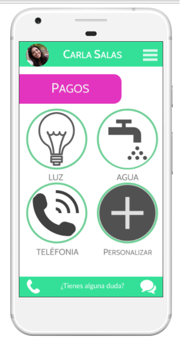

 #### 5.- Realización del Prototipado - Alta fidelidad (Versión 02)

   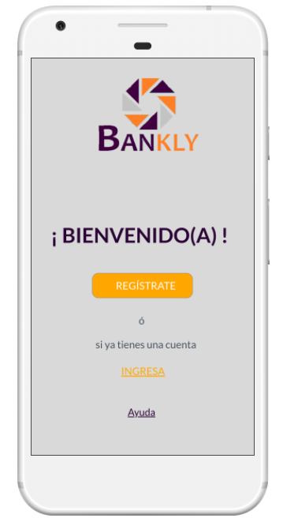
   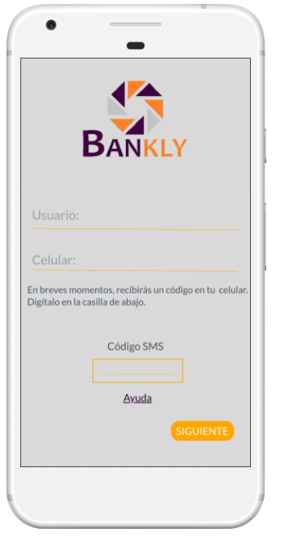
   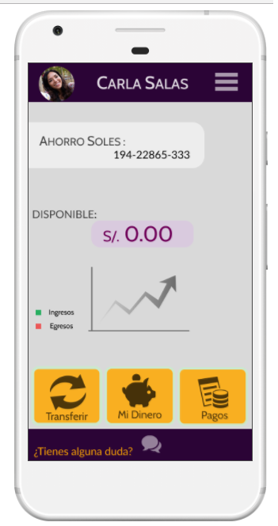
   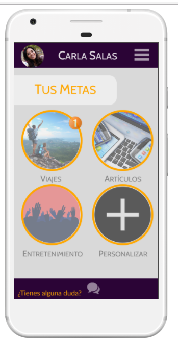
   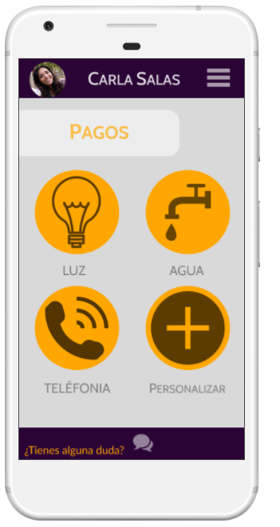

 ## E. Testing

  ### Actividades:

  **I.- Testing del Paper Prototyping**

   Se hizo testing del Paper Prototyping. La finalidad: obtener feedback para mejorar el flujo de nuestro producto antes de realizar el prototipado del MVP.

  1.- Entrevistas a 6 usuarios.
  2.- El proceso consistió en explicar el objetivo del prototipo y el flujo con un tiempo de 15 minutos por usuario.
  3.- Después de recibir feedback se procedió a mejorar el paper prototyping.
  4.- Finalmente pasamos a prototipar nuestras vistas en Marvel y Figma.

  Se obtuvo los sgtes. Feedback's:

  **Testing 01:**

    * No entiendo por qué hay un recuadro de código en el registro.
    * No está tan claro cómo voy a seguir a la siguiente vista, no hay botones, antes de indicarme los pasos.
    * Me confunde que me pida que copie mi código de huella dactilar.

  **Testing 02:**

    * El recuadro de código en el registro, qué números debo colocar ahí.
    * Mejor explicación, me pide que copie mi código de huella dactilar, para qué?
    * ¿Cómo puedo ingresar dinero a mi cuenta?

  **Testing 03:**

    * Me gusta que para hacer transferencias no me pide clave token.
    * Es necesario que me indique la lista de las empresas de los servicios básicos.
    
  **Testing 04:**

    * Es muy confuso cuando me solicita que copie el código de mi huella dactilar, debería guardarse automáticamente.
    * Me gustaría conocer la información básica sobre lo que ofrecen en cada tipo de cuenta.

  **Testing 05:**

    * El recuadro de código en el registro, debería informarme que me enviarán un mensaje a mi celular.
    * Confuso la vista anterior para conocer los pasos, no hay botones qu me indiquen que continue.
    * En las metas deben canjear cupone de descuentos.

  **Testing 06:**

    * Confuso que al inicio de registrame me pida un nombre de usuario y en la siguiente vista me pida mi nombre otra vez.
    * Si no tengo DNI, ¿cómo puedo registrarme?
    * Confirmación para la transferencia.

  **Resultado final Prototipo - Alta fidelidad (Versión 01)**

  [Prototipado Alta Fidelidad_1](https://marvelapp.com/project/2779796/)

  **II.- Testing de Prototipo - Alta fidelidad (Versión 01)**

Después de la exposición se obtuvo feedback de nuestro producto:

**Gonzalo:**
      
    * El color del producto debe de ser mejorado para una mejor diseño visual.
    * Los iconos deben ser consistentes en forma, tamaño y color.
    * El botón de depósito, debe ser ubicado en un mejor lugar de la aplicación.
    * Desarrollar la seguridad a través de otro medio que la huella dactilar.

## Presentación final

[Presentación final](https://marvelapp.com/41eiae5/screen/39555290)

